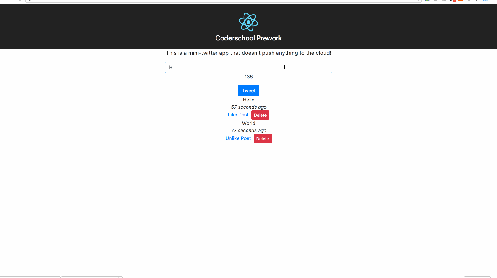

# Prework - *A Mini Twitter React Application*

Submitted by: **Toan Ngo**

Time spent: **~5** hours

### The following **optional** functionality is complete:
* [x] Styling using frameworks like Bulma. (used bootstrap)
* [x] Adding user avatars and “time ago” to Tweets.

## Video Walkthrough

Here's a walkthrough of implemented user stories:

## Notes

Describe any challenges encountered while building the app.

## License

    Copyright [2017] [Toan Ngo]

    Licensed under the Apache License, Version 2.0 (the "License");
    you may not use this file except in compliance with the License.
    You may obtain a copy of the License at

        http://www.apache.org/licenses/LICENSE-2.0

    Unless required by applicable law or agreed to in writing, software
    distributed under the License is distributed on an "AS IS" BASIS,
    WITHOUT WARRANTIES OR CONDITIONS OF ANY KIND, either express or implied.
    See the License for the specific language governing permissions and
    limitations under the License.